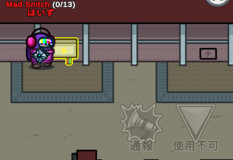
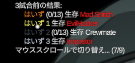

# TownOfHost-H

This mod is not affiliated with Among Us or Innersloth LLC, and the content contained therein is not endorsed or otherwise sponsored by Innersloth LLC. Portions of the materials contained herein are property of Innersloth LLC. © Innersloth LLC.

[本家TownOfHostのreadme](https://github.com/tukasa0001/TownOfHost/blob/main/README.md#town-of-host)  
公開ルームは禁止

## 本家との変更点

### 追加役職

#### EvilHacker/イビルハッカー

インポスター強化役職  
相方生存中，相方の方向を指す矢印が名前に表示される  
毎会議開始時にチャットに最終のアドミン情報が送られる  
インポスターがいる部屋には★印がつく  
死体のある部屋には死体の数が表記される  
他のインポスターがキルを行うとキルフラッシュが見え，名前の3行目にキルの発生した部屋が10秒間通知される

* オプション(デフォルトですべてON)
  * 死体位置がわかる - アドミン情報で死体の数を表示するかどうか
  * 他のインポスターの位置がわかる - アドミン情報で★印を表示するかどうか
  * インポスターキル時にキルフラッシュが見える
    * キルの発生場所がわかる - 能力の性質上キルフラのオプションがONの場合しか設定できません
  * 他のインポスターを指す矢印が見える - 相方の方向を指す矢印が見えるかどうか
  * 死亡時､生存インポスターに能力を引き継ぐ - ONにすると自分が死亡したら素インポスターに能力を引き継ぐ

チャットに送信されるアドミン情報の例

```text
コックピット: 2
★武器庫: 1
通信室: 1(死体×1)
★エンジンルーム: 2(死体×1)
...
```

アイデア元: [haoming37/TheOtherRoles-GM-Haoming](https://github.com/haoming37/TheOtherRoles-GM-Haoming)，[tomarai/TheOtherRoles](https://github.com/tomarai/TheOtherRoles/tree/dev-v3.4.x)

### 追加機能

#### カメラの時間制限

デバイス無効化の子オプション｢カメラの時間制限(全マップ)｣を追加(デフォルトOFF)  
全体でカメラを使用できる時間を制限できる  
会議開始時にチャットで全員に向けて残り時間が通知される  
秒数の更新は追放画面の終了時に行われるため，消費された直後の会議のチャット通知では反映されない(その次の会議で秒数が減る)  
全部使い切るとカメラ画面がコミュサボ状態になり，Mod導入者はその画面を閉じると以後開けなくなる(バニラ参加者は開かないように)  
Mod視点では前を通っただけで壊れていることがわかってしまうので，バニラ参加者が壊れたカメラの前を通ると名前の3行目に｢使用不可｣と通知されるようにしている

> **Note**
> 他デバイスの制限は現時点で技術的に不可能

#### マッド系役職のオプション追加

##### 狂信タスクの易化

マッドスニッチに子オプション｢必要なタスク数を指定する｣を追加(デフォルトOFF)  
これを指定すると，例えば｢マッドスニッチにはタスクが5個配られるが，そのうちどれか1個を終わらせれば狂信能力が発動する｣というようなことが可能

##### 配電盤事故の防止

マッド系共通オプション内，サボタージュ修復可否の設定項目の下に｢Mod導入済マッド系プレイヤーは開けない｣を追加  
ONにすると，**Mod導入者のみ**，直せないよう設定されたサボタージュの画面は開けなくなる  
主にマッドメイトが配電盤を見ることができないレギュで間違って見てしまう事故の防止用



#### Discordとの連携

試合終了時に試合結果をDiscordに送信する機能

##### 手順

1. Modを導入した状態で一度アモアスを起動すると`Among Us.exe`と同じ階層に`WebhookUrl.txt`が生成される
2. これの中身を全部消して，DiscordのWebhook(チャンネル設定→連携サービス→ウェブフックを作成)のURLを貼り付けて保存
3. アモアスの歯車の設定から｢Discordに試合結果を送信｣をONにする

廃村時や自身がホストでないとき，URLが正常に設定されていないときは何も送信しない

#### ロビーでの試合結果表示

歯車の設定から｢ロビーで前の試合の結果を表示｣をONにすると，試合終了時に左上に出てくる試合結果をロビーに戻った後でも確認することができる



#### はしご中のキルをブロック

はしご中にキルしてインポスターが壁にめり込むのを防止

#### 千里眼

｢死者の千里眼(Mod導入者)｣オプションを追加  
幽霊のMod導入者は千里眼を使用できるようになる  
ホットキーはキルボタンの設定と同じ  
霊界サボの選択に使えてしまうと公平ではないのでインポスターは使えないようにするオプションあり

### 変更点

* 名前上の役職テキストの文字サイズを少し大きく調整
* 黒猫レギュ向けにオプションのデフォルト値を調整
* Mod設定のUIを一新

## CREDITS&THANKS

* [tukasa0001/TownOfHost](https://github.com/tukasa0001/TownOfHost) - fork元
* [BepInEx](https://github.com/BepInEx)
* [tomarai/TheOtherRoles](https://github.com/tomarai/TheOtherRoles/tree/dev-v3.4.x) - EvilHackerの役職および能力のアイデア元
* [haoming37/TheOtherRoles-GM-Haoming](https://github.com/haoming37/TheOtherRoles-GM-Haoming) - EvilHackerの能力のアイデア元
